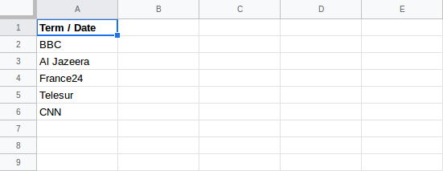

## Google Trends Scraper

Google Trends Scraper is an [Apify actor](https://apify.com/actors) for extracting data from [Google Trends](https://trends.google.com/trends) web site. Currently it scrapes only *Interest over time* data. It is build on top of [Apify SDK](https://sdk.apify.com/) and you can run it both on [Apify platform](https://my.apify.com) and locally.

- [Input](#input)
- [Output](#output)
- [Extend output function](#extend-output-function)
- [Open an issue](#open-an-issue)

### Input

| Field | Type | Description |
| ----- | ---- | ----------- |
| searchTerms | array | (Required if 'spreadsheetId' is not provided) List of search terms to be scraped. |
| spreadsheetId | string | (Optional) Id of the google sheet from where search terms will be loaded. |
| maxItems | number | (optional) Maximum number of product items to be scraped |
| extendOutputFunction | string | (optional) Function that takes a JQuery handle ($) as argument and returns data that will be merged with the default output. More information in [Extend output function](#extend-output-function) |
| proxyConfiguration | object | (optional) Proxy settings of the run. If you have access to Apify proxy, leave the default settings. If not, you can set `{ "useApifyProxy": false" }` to disable proxy usage |

**Notes on the input as a spreadsheet**
- Currently the only spreadsheet allowed is a Google sheet.
- Spreadsheet must have only one column.
- The first row of the spreadsheet is considered the title of the column so it will not be loaded as a search term.

Google sheet example:



INPUT Example:

```
{
  "searchTerms": [
    "test term",
    "another test term"
  ],
  "spreadsheetId": "1Dkf0VahLpp5tD6DOsopL7O-Nm7qD16Ie6VK_R9rt5p8",
  "maxItems": 100,
  "extendOutputFunction": "($) => { return { test: 1234, test2: 5678 } }",
  "proxyConfiguration": {
    "useApifyProxy": true
  }
}
```

### Output

Output is stored in a dataset.

If no spreadsheet ID is provided, the output will have an item for each piece of data.
Example:
```
{
  "searchTerm": "CNN",
  "date": "‪Feb 10, 2019‬",
  "value": 80
}
```

If spreadsheet ID is provided, the output will have a different format: one item for each search term which will contain all data about the search term. This way you can download the output as a nicely formatted spreadsheet from the *dataset* tab of your actor run.
Example:
```
{
  "Term / Date": "CNN",
  "‪Jan 13, 2019‬": 92,
  "‪Jan 20, 2019‬": 100,
  "‪Jan 27, 2019‬": 86,
  "‪Feb 3, 2019‬": 82,
  ...
}
```

### Extend output function

You can use this function to update the default output of this actor. This function gets a JQuery handle `$` as an argument so you can choose what data from the page you want to scrape. The output from this will function will get merged with the default output.

The **return value** of this function has to be an **object**!

You can return fields to achieve 3 different things:
- Add a new field - Return object with a field that is not in the default output
- Change a field - Return an existing field with a new value
- Remove a field - Return an existing field with a value `undefined`

The following example will add a new field:
```
($) => {
    return {
        comment: 'This is a comment',
    }
}
```

### Open an issue
If you find any bug, please create an issue on the actor [Github page](https://github.com/emastra/actor-google-trends-scraper).
